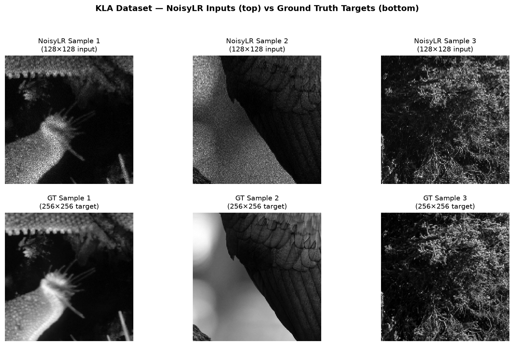
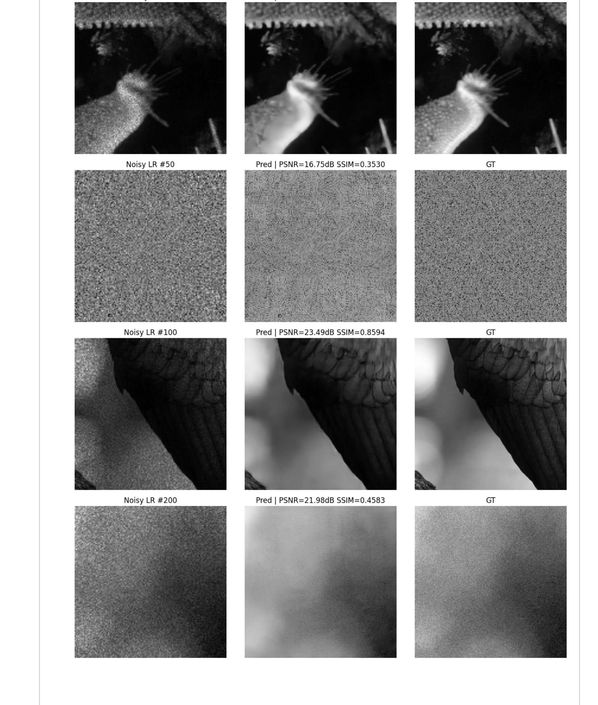

# SiliconVision — KLA Hackathon 2026 | Track 1: Image Restoration

<div align="center">



[](https://python.org)
[](https://pytorch.org)
[](https://onnx.ai)
[](LICENSE)

**Team SiliconVision — Nirma University**  
Heet Yadav &nbsp;|&nbsp; Bhavin Umatiya &nbsp;|&nbsp; Het Patel &nbsp;|&nbsp; Harsh Patel

</div>

---

## The Problem

KLA inspection tools capture semiconductor SEM images degraded by two compounding effects:

- **Noise**: Speckle + Gaussian noise from the acquisition process
- **Resolution loss**: Images are 128×128, but defect analysis requires 256×256

These aren't separate problems — they compound. A standard denoiser followed by an upsampler accumulates error at each stage and doubles inference latency.

---

## Our Solution: SemiRestoreNet

A **single end-to-end model** that jointly denoises and 2× super-resolves semiconductor images in one forward pass.

```
Input: Noisy LR  (1 × 128 × 128)  →  Output: Clean HR  (1 × 256 × 256)
```

### Architecture

```
NoisyLR (1×128×128)
    │
    ├─ Encoder: Conv + ResBlock × 3 stages  [32 → 64 → 128 → 256 ch]
    │            Stride-2 downsampling at each stage
    │
    ├─ Bottleneck: DepthwiseSepConv × 2 + ResBlock  [256ch @ 16×16]
    │              4× parameter savings vs standard conv
    │
    ├─ Decoder:  PixelShuffle 2× + Skip concat + Conv × 3 stages
    │            [128 → 64 → 32 ch]
    │
    └─ Output Head: Conv → PixelShuffle(2×) → Sigmoid
         │
    Clean HR (1×256×256)
```

**Five design choices that matter:**

| Decision | Why |
|----------|-----|
| Joint denoise + SR | Eliminates cascaded error; single inference step |
| PixelShuffle upsampling | Sub-pixel precision preserves circuit feature edges; no checkerboard |
| DepthwiseSepConv bottleneck | 4× fewer params at lowest resolution; fast inference |
| No BatchNorm | Better generalization to OOD test data (real fab conditions vary) |
| Skip connections | Preserve fine spatial detail lost during encoding |

---

## Dataset Used for Training

The model was trained on the KLA Hackathon dataset consisting of paired semiconductor SEM images:
- **NoisyLR**: 128×128 images with speckle/Gaussian noise and reduced resolution.
- **GT (Ground Truth)**: 256×256 clean images.


*Top: NoisyLR Inputs (128×128) | Bottom: Ground Truth Targets (256×256)*

---

## Results


### Sample Predictions — Noisy LR Input → Our Prediction → Ground Truth



*Each row: Noisy 128×128 input (left) → SemiRestoreNet 256×256 output (center) → Ground Truth 256×256 (right)*

- Row 1: **PSNR 31.24 dB, SSIM 0.8879** — strong structural recovery on complex textures
- Row 3: **PSNR 23.49 dB, SSIM 0.8594** — edge details recovered from heavily degraded input

---

## Loss Function

```
Total Loss = 0.6 × L1  +  0.3 × SSIM  +  0.1 × Perceptual (VGG16)
```

| Component | Weight | Purpose |
|-----------|--------|---------|
| L1 | 0.60 | Pixel accuracy, stable convergence |
| SSIM | 0.30 | Structural integrity of circuit patterns |
| Perceptual (VGG16 relu2_2) | 0.10 | Texture sharpness, avoids over-smoothing |

---

## Deployment

The model is exported to ONNX (opset 17) and validated with ONNX Runtime:

```python
# Input:  (batch, 1, 128, 128) — NoisyLR float32
# Output: (batch, 1, 256, 256) — Clean HR float32 in [0,1]
```

**Deployment path:**
```
PyTorch checkpoint (.pth)
    → ONNX (opset 17)          ← validated ✓
        → ONNX Runtime (CPU/GPU)
        → Intel OpenVINO (FPGA/VPU)
        → NVIDIA TensorRT (H100)
        → AMD Vitis AI (ZCU104 DPU)   ← our hardware target
```

---

## Repository Structure

```
siliconvision-kla-2026/
│
├── src/
│   ├── dataset.py       # Data loader — per-sample normalization, augmentation
│   ├── model.py         # SemiRestoreNet architecture
│   ├── losses.py        # Combined L1 + SSIM + Perceptual loss
│   ├── metrics.py       # PSNR, SSIM, LPIPS evaluation
│   ├── train.py         # Training loop — AMP, cosine LR, checkpointing
│   └── evaluate.py      # Standalone evaluation script (submission format)
│
├── notebook/
│   └── SemiRestoreNet_Colab.ipynb   # Full reproducible Colab notebook
│
├── assets/
│   ├── dataset_samples.png          # Sample dataset pairs
│   └── predictions_grid.png         # Before / After / GT comparison
│
├── models/`n│   └── best_model.pth           # Pre-trained model weights (59MB)`n├── run.py                       # Main inference script
└── requirements.txt
```

---

## Quick Start

> [!IMPORTANT]
> **Dataset Setup**
> The KLA Hackathon dataset is not included in this repository due to size limits. You must download it yourself.
> When running the scripts below, you must replace `/path/to/Dataset/...` with the actual path to your dataset on your local machine. Alternatively, you can place the dataset in a folder named `Dataset` inside this repository and omit the path arguments entirely.

### 1. Install dependencies
```bash
pip install -r requirements.txt
```

### 2. Train
```bash
python src/train.py \
  --epochs 100 \
  --batch_size 16 \
  --train_noisy_dir /path/to/Dataset/train/NoisyLR \
  --train_gt_dir    /path/to/Dataset/train/GT
```

### 3. Evaluate (Submission Format)
To run inference on new blind test images:
```bash
python src/evaluate.py \
  --input_dir  /path/to/Dataset/NoisyLR \
  --output_dir ./predictions \
  --model_path ./best_model.pth \
  --gt_dir     /path/to/Dataset/train/GT   # Optional: Include to automatically compute PSNR/SSIM
```

### 4. Run in Colab (recommended)
Open [`notebook/SemiRestoreNet_Colab.ipynb`](notebook/SemiRestoreNet_Colab.ipynb) — everything runs in order from data loading to ONNX export.

---

## Training Details

| Config | Value |
|--------|-------|
| Dataset | 3,200 train pairs (128×128 → 256×256) + 400 blind test |
| Train / Val split | 2,880 / 320 (90/10) |
| Augmentation | Random flip + rot90 |
| Optimizer | AdamW, lr=3e-4, weight_decay=1e-4 |
| LR Schedule | Cosine annealing with 5-epoch linear warmup |
| Mixed Precision | AMP (fp16) on GPU |
| Best epoch | 88 / 100 |
| Hardware | Google Colab A100 GPU |

---

## References

1. Ronneberger et al. (2015). *U-Net: Convolutional Networks for Biomedical Image Segmentation.* MICCAI. [arxiv:1505.04597](https://arxiv.org/abs/1505.04597)
2. Zhang et al. (2017). *Beyond a Gaussian Denoiser: Residual Learning of Deep CNN for Image Denoising.* IEEE TIP. [arxiv:1608.03981](https://arxiv.org/abs/1608.03981)
3. Shi et al. (2016). *Real-Time Single Image SR Using an Efficient Sub-Pixel CNN.* CVPR. [arxiv:1609.05158](https://arxiv.org/abs/1609.05158)
4. Johnson et al. (2016). *Perceptual Losses for Real-Time Style Transfer and SR.* ECCV. [arxiv:1603.08155](https://arxiv.org/abs/1603.08155)
5. Wang et al. (2004). *SSIM: Image Quality Assessment.* IEEE TIP.
6.  Training Dataset: SiliconVision SEM Noisy-Clean Image Pairs (3,200 train / 320 val / 400 test). Available at: 
   https://drive.google.com/drive/folders/1VKiFW-kDk9-q5XRPu3nrl08OM94EwzV6

---

<div align="center">

**SEMICON India Hackathon 2026 &nbsp;|&nbsp; Track 1: KLA Image Restoration**  
Heet Yadav &nbsp;|&nbsp; Bhavin Umatiya &nbsp;|&nbsp; Het Patel &nbsp;|&nbsp; Harsh Patel — Nirma University

</div>
